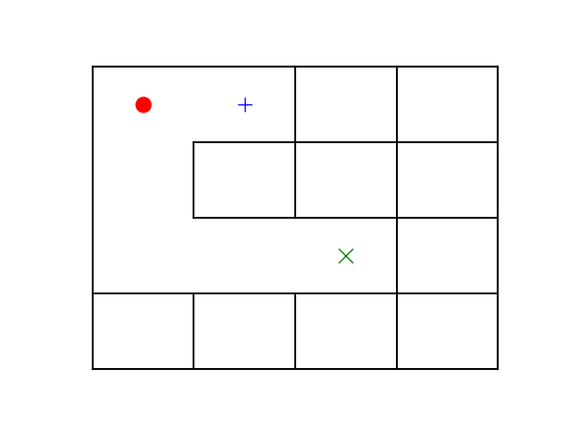
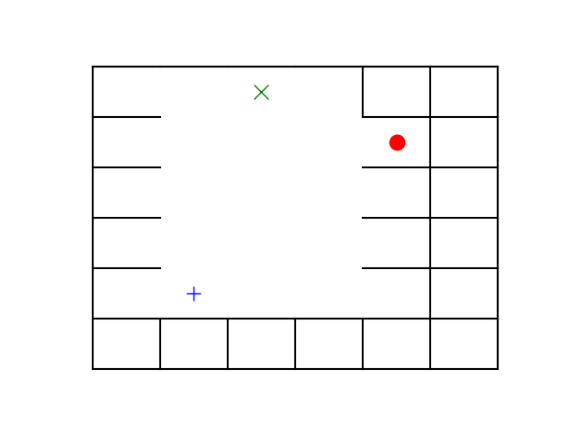

# DungeonMapGenerator

The objective of this project is to develop a map generator capable of producing a maze with a starting point, an ending
point, and a treasure location. the starting point and the ending point, as well as the treasure point and the
starting point, should be connected by a path.

The map generator creates a QTable through the application of Q-learning, which must subsequently be utilized to create
a path connecting the three randomly generated locations (the starting, ending, and treasure point).

[DungeonMapGenerator](src/README.md) doc

The Maze Generator API Service is built with FastAPI.

FastAPI is a cutting-edge, quick web framework for creating APIs.

## Run locally

### Install dependencies

```
pip install src/
```

```
pip install -r api_requirements.txt
```

### Run server

[//]: # ()
[//]: # (```)

[//]: # (uvicorn serving.main:app --reload)

[//]: # (```)

#### With a custom port and workers

```
uvicorn serving.main:app --reload --workers 1 --host 0.0.0.0 --port 8092
```

---

## Run with docker

### Build the image

```bash
docker build -t maze_generator_image .
```

### Run a container

[//]: # (If you want to specify a port mapping: <host_port>:<container_port>)

```bash
docker run -d -e PORT=8080 -p 8092:8080 maze_generator_image
```

[//]: # (or)

[//]: # ()
[//]: # (```bash)

[//]: # (docker run -p 8080:8080 maze_generator_image)

[//]: # (```)

----

## API documentation (provided by Swagger UI)

Access: http://0.0.0.0:8000/docs or http://0.0.0.0:8092/docs if you run the server providing the port 8092 for example.

And you can use `curl` command to query the API and save the image:

```bash
curl -X 'POST' \
  'http://0.0.0.0:8092/generate_maze' \
  -H 'accept: application/json' \
  -H 'Content-Type: application/json' \
  -d '{
  "maze_size": 4,
  "alpha": 0.8,
  "discount": 0.9,
  "epsilon": 0.2,
  "num_episodes": 100000
}' \
  > output.png
```

or

```bash
curl -X 'POST' \
  'http://0.0.0.0:8092/generate_maze' \
  -H 'accept: application/json' \
  -H 'Content-Type: application/json' \
  -d '{"maze_size": 4}' \
  > output.png
```
-----

#### Input parameters:

*maze_size*: represents the (width=maze_size, height=maze_size) of the maze to be generated.

*alpha*: is the learning rate, typically set between 0 and 1. If the alpha value is set to 0, the Q-values are never
updated,
consequently, nothing is learned. When the alpha is set to a high value, like 0.9, learning can take place quickly.

*discount*: is the discount factor that should be set between 0 and 1. This illustrates the fact that future rewards are
worth less than immediate rewards.

*epsilon*: is related to the epsilon-greedy action selection procedure in the Q-learning algorithm. It introduces
randomness into the algorithm, forcing the algorithm to try different actions. This helps not to get stuck in a local
optimum. Epsilon is typically chosen as a tiny number close to 0.

*num_episodes*: represents the q learning algorithm training episodes. Running more episodes allows Q table to be
learned by more trial-and-error interactions with the environment.

----
#### Output Response:

A plot of the generated maze (Grid (maze_size*maze_size)) with "x" markers representing the starting point,
"+" marker representing the treasure point and "o" marker representing the ending point.

---
### Run api + ui services:

```bash
docker-compose up --build
```
then
http://localhost:8501 or http://172.18.10.3:8501/

---

#### Generated maze examples:

Legend: "x"= starting point, "+": treasure point, "o": end point.



---

#### Evaluating the difficulty of a maze:

We can evaluate the difficulty of a maze using the following metrics:

- Completion time of a maze
- The number of Forks along the correct path:
    - If the perfect path only has one branch, then you only need to be lucky once.
- The number of Loops:
    - Path loops can make a maze more difficult because it is simple to realize that you are on the
      wrong road when you reach a dead end, but if you go in circles, you may visit the same path repeatedly before
      realizing you should be somewhere else.
- The number of three-way intersections and number of four-way intersections.
- The number of elbow cells  (e.g. passage entering from downside (going upwards), then turning either right or left)
